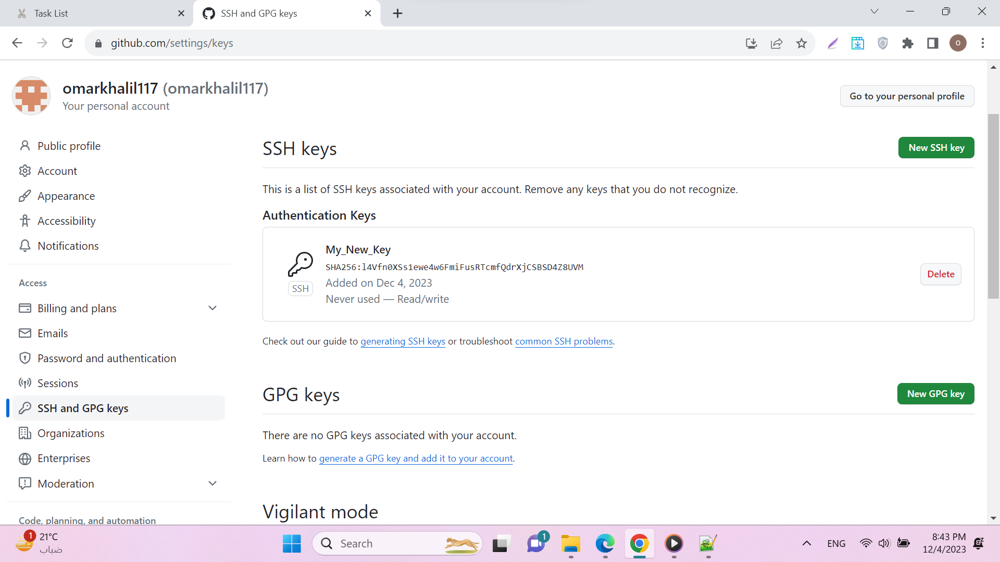
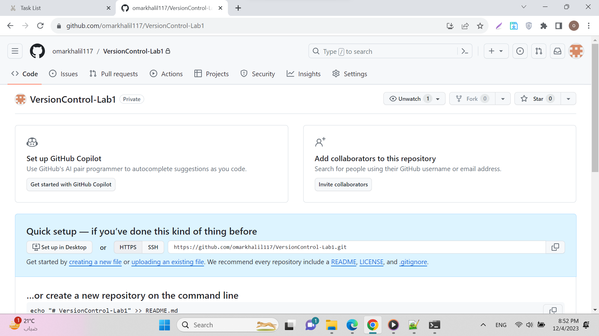

# Lab [1]

## 1.Create a SSH key and put the key in GitHub
### use command ssh-keygen -t ed25519 -m [My_Message]

### get the public key from file id_ed25519.pub and add it to my profile

### My key successfully added to my account

## 2. Create a new local repo and a remote repo on GitHub, then make a file
## contains your full name, then push it to the remote repo, and send an invitation to me.
### initialize local repo with `git init` command

### create remote repo named VersionControl-Lab1

- check local repo status using `git status` command
- add **all** files to stage area using `git add .` command
- commit the added files with comment "First Commit" using `git commit -m "First Commit"` command
- check repo status and see my recent commit

- connect my local repo with my remote repo using `git remote add origin [ssh-link]` command
- push my commit from local repo to my remote repo using `git push -u origin master` command

## My commit successfully pushed to my remote repo

## Sending invitation :D

